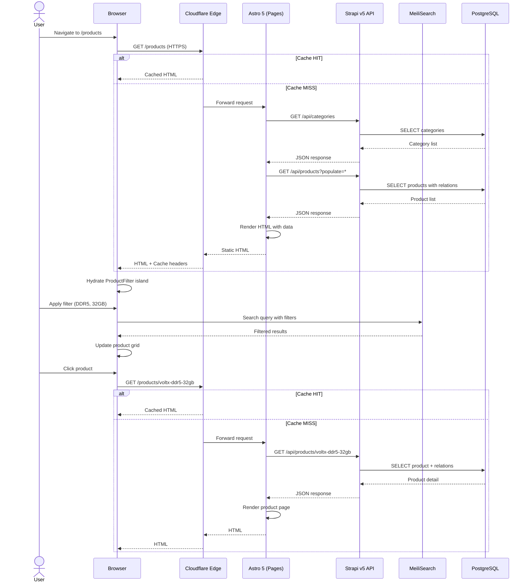
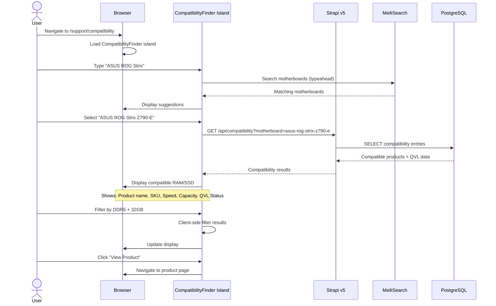
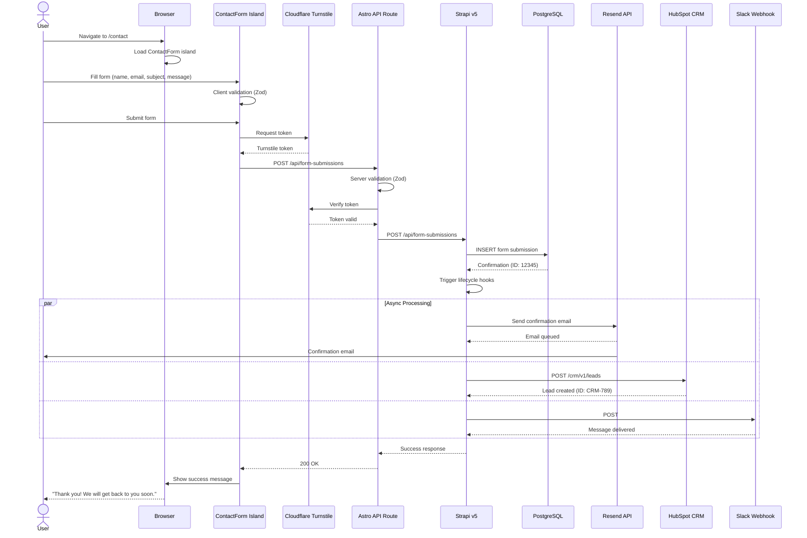
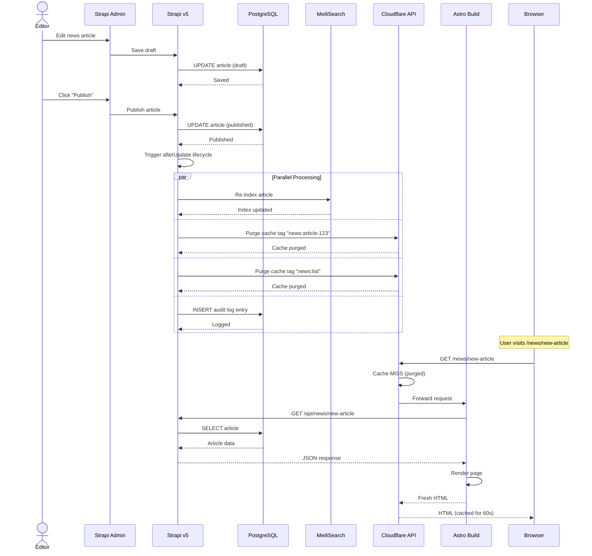
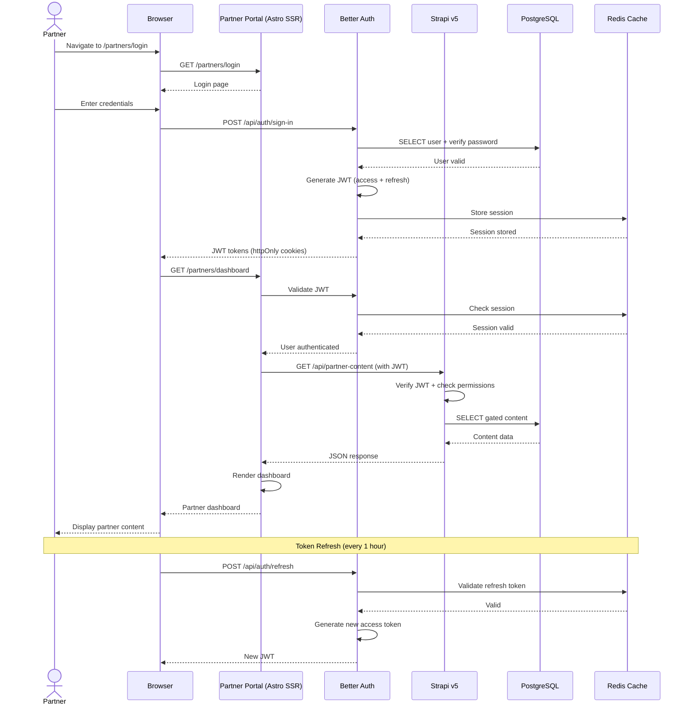
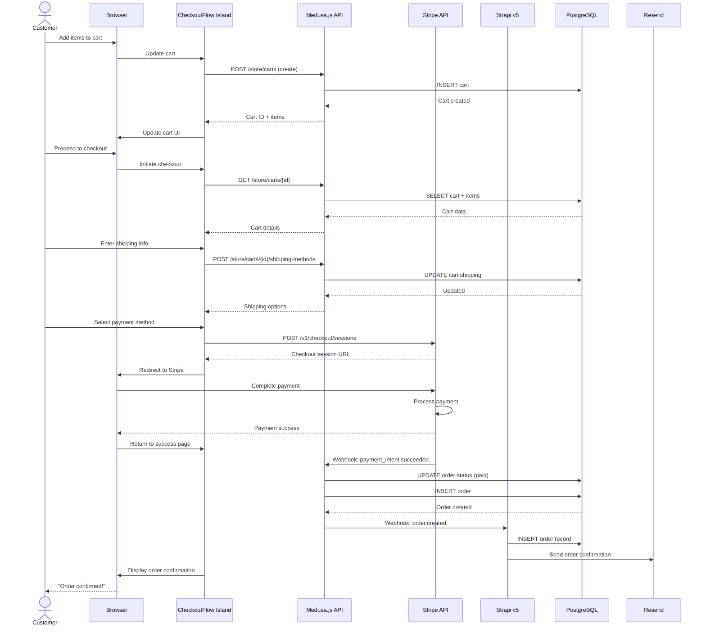
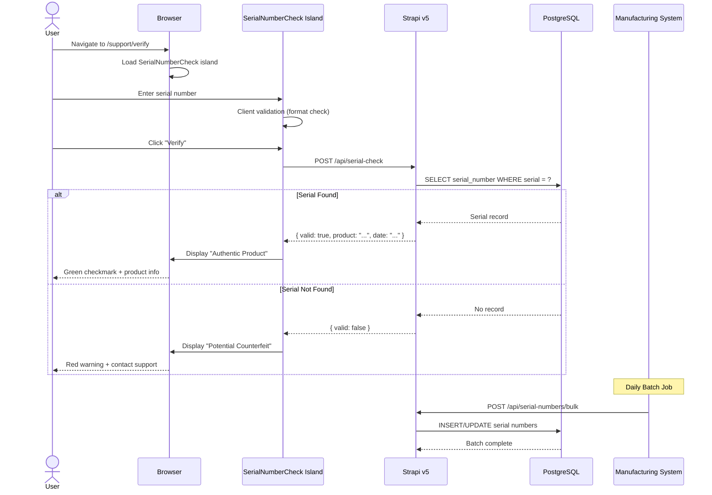
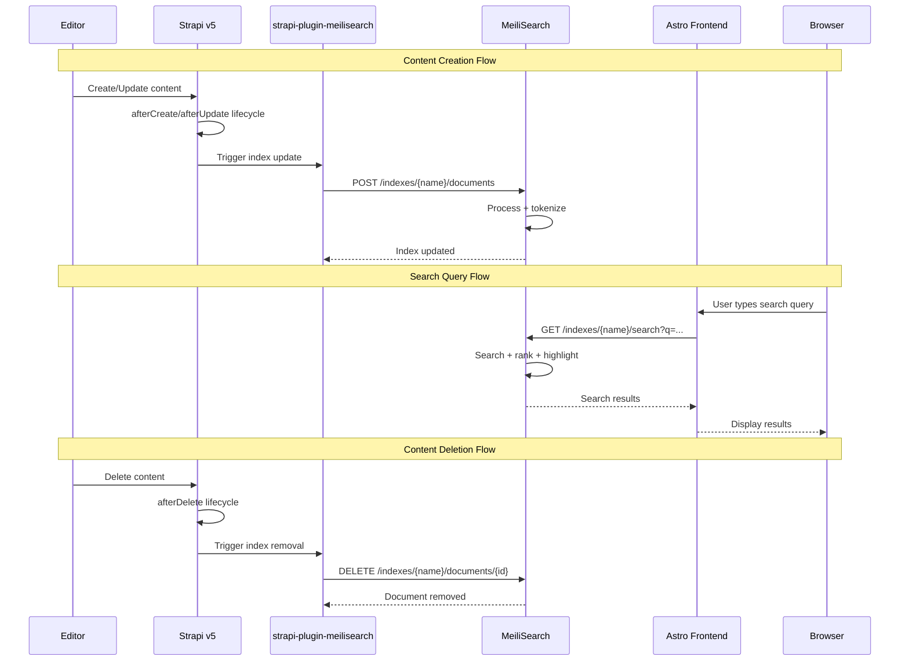
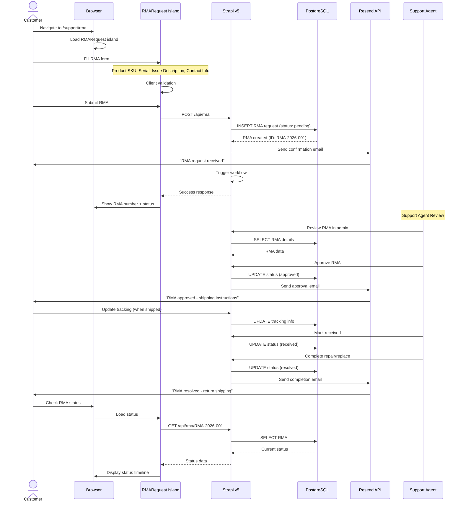

# TwinMOS Corporate Website — Sequence Diagrams

**Document Reference:** TWN-SEQ-DIAGRAM-2026-001
**Document Version:** 1.0
**Status:** DRAFT
**Date:** 1 May 2026
**Synchronized With:** URD v3.0, LLD v1.0, Tech Stack v1.1

---

## Table of Contents

1. [User Browses Product Catalog (UC-1.1)](#1-user-browses-product-catalog-uc-11)
2. [Compatibility Finder Search (UC-2.1)](#2-compatibility-finder-search-uc-21)
3. [Form Submission (UC-4.1)](#3-form-submission-uc-41)
4. [CMS Content Publish to ISR Invalidate](#4-cms-content-publish-to-isr-invalidate)
5. [User Login (Partner Portal P2)](#5-user-login-partner-portal-p2)
6. [E-Commerce Checkout (P3)](#6-e-commerce-checkout-p3)
7. [Anti-Counterfeit Serial Check (P2)](#7-anti-counterfeit-serial-check-p2)
8. [Search Indexing Lifecycle](#8-search-indexing-lifecycle)
9. [RMA Workflow (P2)](#9-rma-workflow-p2)

---

## 1. User Browses Product Catalog (UC-1.1)

---

## 2. Compatibility Finder Search (UC-2.1)

---

## 3. Form Submission (UC-4.1)

---

## 4. CMS Content Publish to ISR Invalidate

---

## 5. User Login (Partner Portal P2)

---

## 6. E-Commerce Checkout (P3)

---

## 7. Anti-Counterfeit Serial Check (P2)

---

## 8. Search Indexing Lifecycle

---

## 9. RMA Workflow (P2)

