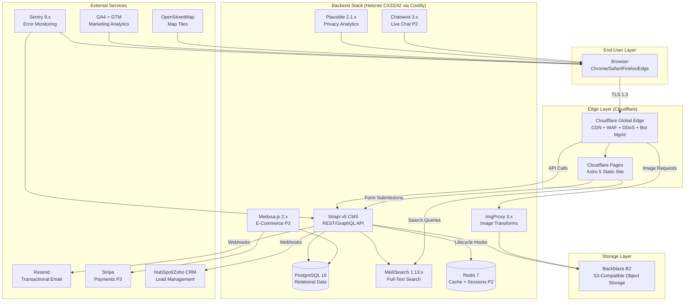
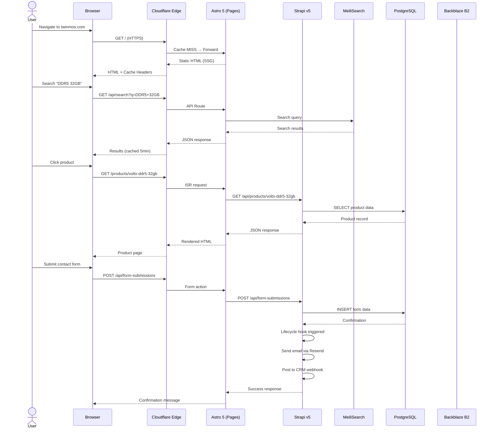
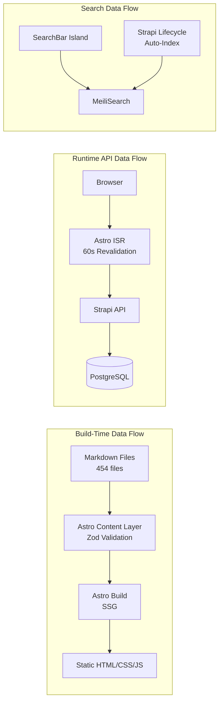
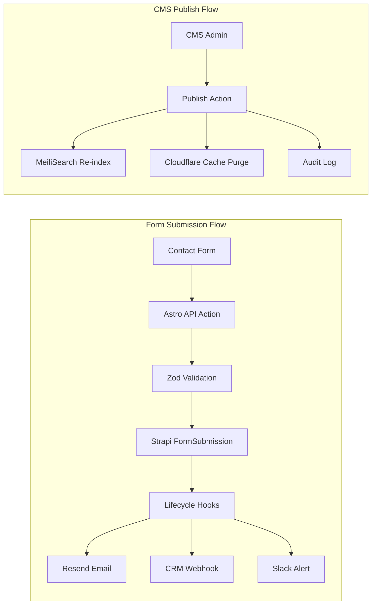
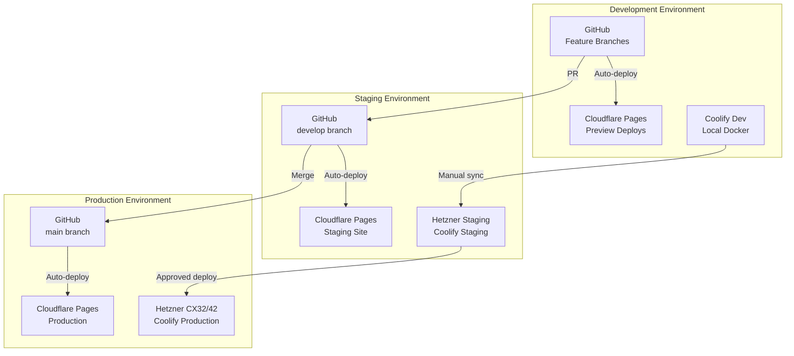
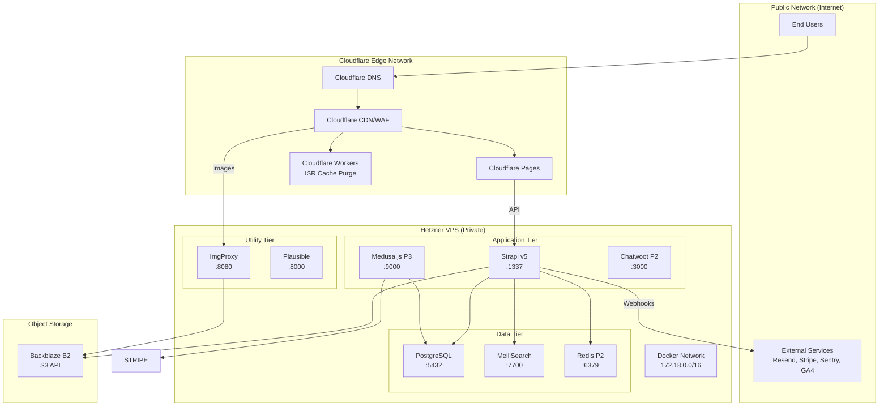
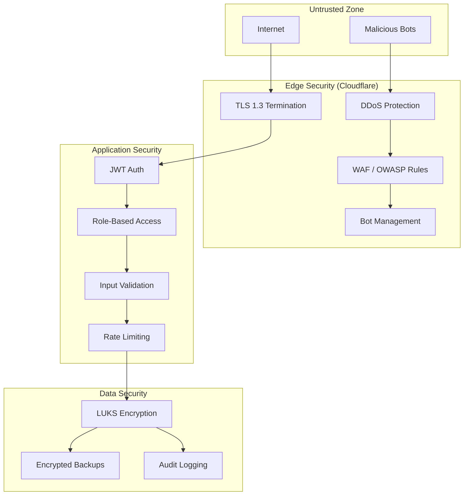
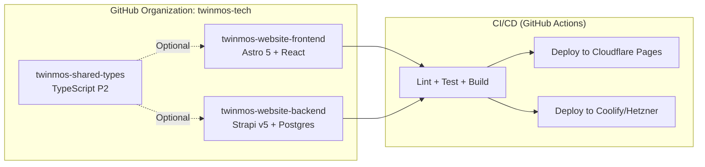
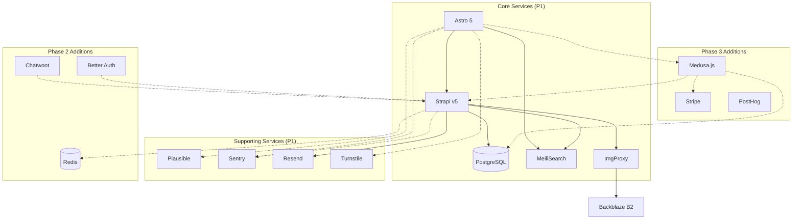
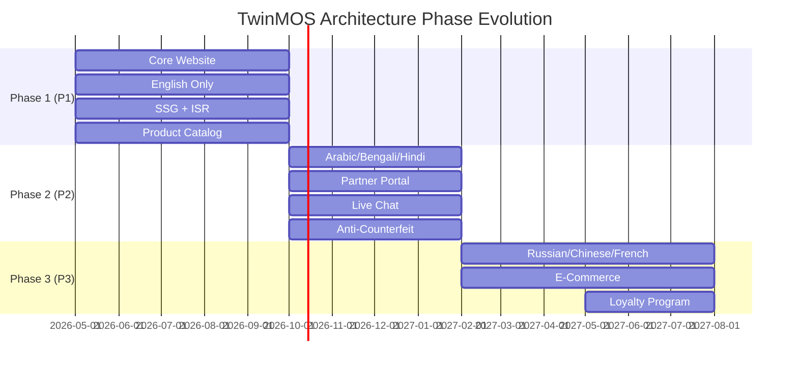

# TwinMOS Corporate Website — System Architecture Diagram

**Document Reference:** TWN-ARCH-DIAGRAM-2026-001
**Document Version:** 1.0
**Status:** DRAFT
**Date:** 1 May 2026
**Synchronized With:** HLD v1.0, Tech Stack v1.1

---

## 1. Top-Level System Architecture

---

## 2. Component Interaction Diagram

---

## 3. Data Flow Diagram — Read Paths

---

## 4. Data Flow Diagram — Write Paths

---

## 5. Deployment Topology Diagram

---

## 6. Network Segmentation Diagram

---

## 7. Security Boundary Diagram

---

## 8. Repository Topology

---

## 9. Service Dependency Map

---

## 10. Phase Evolution Diagram

